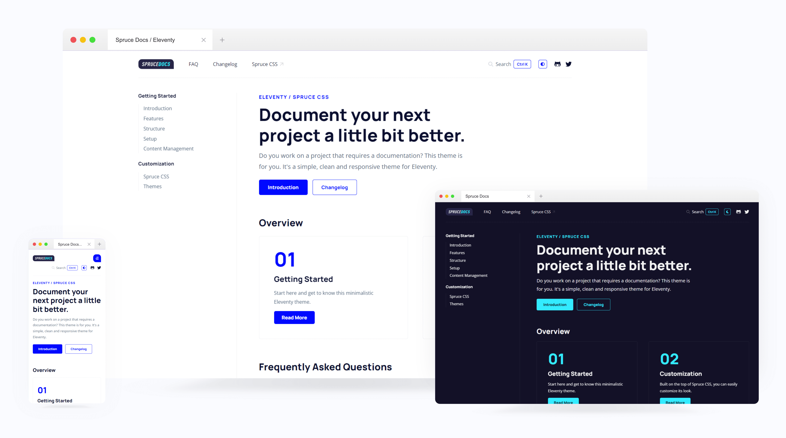

<p>
    <a href="https://sprucecss.com/">
        <br>
        <picture>
            <source media="(prefers-color-scheme: light)" srcset="./.github/spruce-logo-dark.svg">
            <source media="(prefers-color-scheme: dark)" srcset="./.github/spruce-logo-light.svg">
            
        </picture>
        <br>
    </a>
</p>

**Welcome to the official documentation of **Spruce Docs** Elventy theme. A small template you can use to document any of your projects.**

<br>




[](https://github.com/conedevelopment/sprucecss-eleventy-documentation-template/releases/latest)
[](https://github.com/conedevelopment/sprucecss-eleventy-documentation-template/blob/main/LICENSE)

A documentation template is always helpful. There are a lot of solutions to make one; we wanted to create our self-hosted version based on our favorite static site generator [Eleventy](https://www.11ty.dev/).

By structure, it is simple, with two levels and additional custom templates like [FAQ]([/faq/](https://eleventy-documentation.sprucecss.com/faq/)) and [Changelog]([/changelog/](https://eleventy-documentation.sprucecss.com/changelog/)).

## Spruce CSS

The template is built on [Spruce CSS](https://sprucecss.com/), a small and customizable CSS framework. The main benefit of this is that you can use the Spruce UI components with dark mode and RTL support.

## Features

- Breadcrumb navigation built on [11ty Navigation Plugin](https://www.11ty.dev/docs/plugins/navigation/).
- HTML minification in production mode.
- Anchor headings.
- Table of Content.
- FAQ template.
- Changelog template.
- Static search integration with [pagefind](https://pagefind.app/).
- Code highlighting.
- RTL support.
- Dark theme mode.
- [svgIcon](https://github.com/conedevelopment/sprucecss-eleventy-documentation-template/blob/main/src/shortcodes/svg-icon.js) shortcode: render any SVG icon inline and add optional classes.
- [markdownRenderer](https://github.com/conedevelopment/sprucecss-eleventy-documentation-template/blob/main/src/shortcodes/markdown-render.js): render any string (markdown) into HTML.

## Setup

1. **Clone the repository.**

2. **Install the dependencies.**

    In the `package.json` file, you will find all of the dependencies (and scripts) to install them using the following command:

    ```shell
    npm install
    ```

3. **Run the development mode**

    To run the development mode, use the `npm script`.   This script will also watch for changes.

    ```shell
    npm start
    ```

4. **Run the production mode**

    Before you go live, you should use the production script to compress the Sass files.

    ```shell
    npm run prod
    ```

You can find some more npm scripts in the [package.json](https://github.com/conedevelopment/sprucecss-eleventy-documentation-template/blob/main/package.json) that can be helpful.

## Content Managment

Adding content to the template is easy as almost everything is in Eleventy.

### The Basic Structure

Our base folder for the documentation pages is the `posts` folder. You must follow the folder structure, which means the `category` here. If you create a folder, you must make a list page with the same name as the folder. You must also create another `posts` folder under the `category` folder where your posts go. You must create the `posts.json` file that will parameter your `layout` and `permalink` values.

### Eleventy Navigation

The theme utilizes the [Eleventy Navigation plugin](https://www.11ty.dev/docs/plugins/navigation/), so you must explicitly set up the hierarchy. This is needed for the automatic sidebar navigation, the navigation order, and breadcrumb generation.

### Other Pages

To create simple pages, make a file directly under the `src` folder and configure it with the available front matter.

## Structure

```html
spruecss-eleventy-documentation-template/
├─ node_modules/
├─ dist/
├─ src/
│  ├─ _data/
│  ├─ _includes/
│  ├─ css/
│  ├─ filters/
│  ├─ font/
│  ├─ img/
│  ├─ js/
│  ├─ posts/
│  ├─ scss/
│  ├─ shortcodes/
│  ├─ transforms/
│  ├─ changelog.md
│  ├─ faq.md
│  ├─ index.md
├─ .eleventy.js
├─ package.json
├─ README.md
├─ ...

```

- **_data**: Some global data, like the name of your site and helpers like the active navigation element or current year.
- **__includes**: All of the layout and partial templates.
- **css**: The compiled CSS.
- **filters**: The additional filters that you can use.
- **font**: The custom fonts.
- **img**: The static image files.
- **posts**: The markdown contents.
- **scss**: The Sass files.
- **shortcodes**: The available shortcodes.
- **transforms**: The transformations.

<br>

[](https://app.netlify.com/sites/sprucecss-eleventy-documentation/deploys)
