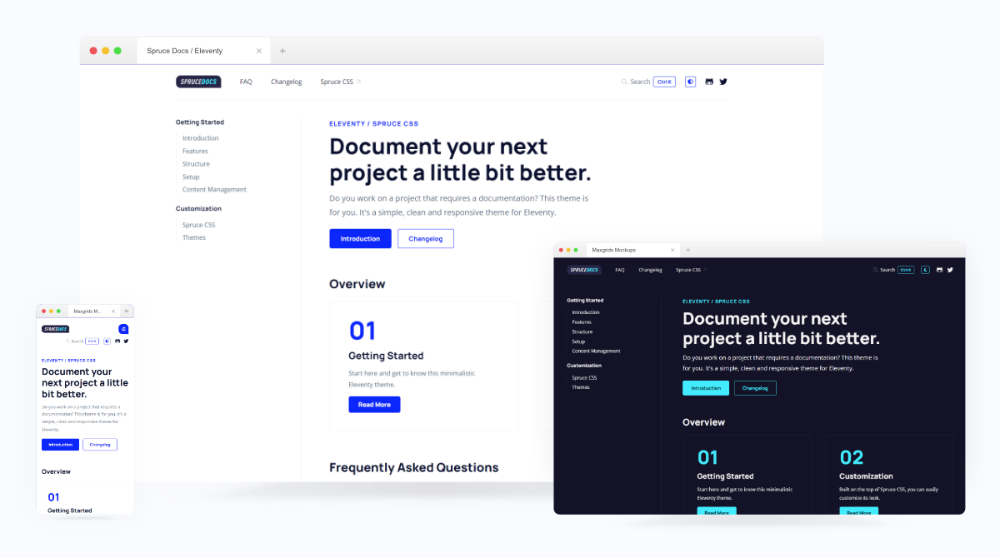

<p>
  <a href="https://sprucecss.com/#gh-light-mode-only">
    <br/>
    
    <br/>
  </a>
  <a href="https://sprucecss.com/#gh-dark-mode-only">
    <br/>
    
    <br/>
  </a>
</p>

**Welcome to the official documentation of **Spruce Docs** Elventy theme. A small template that you can use to document any of your projects.**



[](https://app.netlify.com/sites/sprucecss-eleventy-documentation/deploys)

A documentation template is always helpful. There are a lot of solutions to make one; we wanted to create our self-hosted version based on our favorite static site generator [Eleventy](https://www.11ty.dev/).

By structure, it is simple, with two levels and additional custom templates like [FAQ]([/faq/](https://eleventy-documentation.sprucecss.com/faq/)) and [Changelog]([/changelog/](https://eleventy-documentation.sprucecss.com/changelog/)).

## Spruce CSS

The template is built on [Spruce CSS](https://sprucecss.com/), a small and customizable CSS framework. The main benefit of this is that you can use the Spruce UI components with dark mode and RTL support.


## Features

- Breadcrumb navigation built on [11ty Navigation Plugin](https://www.11ty.dev/docs/plugins/navigation/).
- HTML minification in production mode.
- Anchor headings.
- Table of Content.
- FAQ template.
- Changelog template.
- Static search integration with [pagefind](https://pagefind.app/).
- Code highlighting.
- RTL support.
- Dark theme mode.
- [svgIcon](https://github.com/conedevelopment/sprucecss-eleventy-documentation-template/blob/main/src/shortcodes/svg-icon.js) shortcode: render any SVG icon inline and add optional classes.
- [markdownRenderer](https://github.com/conedevelopment/sprucecss-eleventy-documentation-template/blob/main/src/shortcodes/markdown-render.js): render any string (markdown) into HTML.

## Structure

```html
spruecss-eleventy-documentation-template/
├─ node_modules/
├─ dist/
├─ src/
│  ├─ _data/
│  ├─ _includes/
│  ├─ css/
│  ├─ filters/
│  ├─ font/
│  ├─ img/
│  ├─ js/
│  ├─ posts/
│  ├─ scss/
│  ├─ shortcodes/
│  ├─ transforms/
│  ├─ changelog.md
│  ├─ faq.md
│  ├─ index.md
├─ .eleventy.js
├─ package.json
├─ README.md
├─ ...

```

- **_data**: Some global data, like the name of your site and helpers like the active navigation element or current year.
- **__includes**:All of the layout and partial templates.
- **css**: The compiled CSS.
- **filters**: The additional filters that you can use.
- **font**: The custom fonts.
- **img**: The static image files.
- **posts**: The markdown contents.
- **scss**: The Sass files.
- **shortcodes**: The available shortcodes.
- **transforms**: The transformations.
